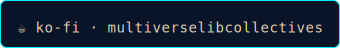

# ⠶ support this spellbook ⠶

if this helped you see where your agents are avoiding work, you can buy me a coffee:

<a href="https://ko-fi.com/multiverselibcollectives" target="_blank" rel="noopener noreferrer" style="display:inline-block;margin-top:10px;font-family:monospace;font-size:13px;color:#e8d5b7;text-decoration:none;">☕ ko-fi · multiverselibcollectives</a>

no account required. tips keep the ward library growing and the audits honest.

every coffee = one more ward named.
